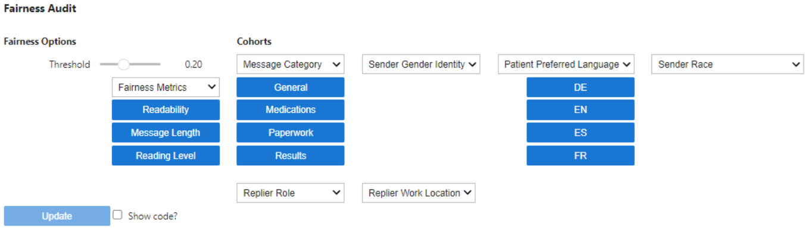

- Feature Name: replace_aequitas_with_fairness_table
- Start Date: 2024-06-05
- RFC PR: [seismometer/rfcs#0002](https://github.com/epic-open-source/seismometer-rfcs/pull/2)
- Seismometer Issue: [seismometer/#26](https://github.com/epic-open-source/seismometer/issues/26)

# Summary
[summary]: #summary

Aequitas uses altair plots to display information, and when hosted in a notebook this causes a number of awkward issues to code around (loading in a frame, loading in vscode, etc). In addition, when there are many different cohort splits that need to be evaluated, the horizontal nature of the table leads to a difficult to read table. 

# Motivation
[motivation]: #motivation

* Why are we doing this? What use cases does it support? What use cases will it NOT support? What is the expected outcome? 

Working with Aequitas's current fairness audit bring in additional complexity and UX concerns. We would like to reduce code complexity, while allowing an extension to non-binary classifier situations. 

# Detailed design
[design]: #design

* Explain the design in enough detail that somebody familiar with the area would understand it and somebody familiar with the code could implement it.

Rather than levering aequitas, we will use great_tables to display a list of computed metrics, as well as the percentage disparity between the a default cohort (the largets subgroup for a chort category) and each other cohort value (excepting any cohort that falls below the censoring threshold). 

An example table for custom metrics would look like


We will have out of the box support for Binary Classifiers, including common existing metrics (false positive rate, accuracy, ppv, etc), that are computed based on a model threshold. This will enables us to drop support for aequitas while maintaining the same functionality.

### TODO add screenshot for BINARY CLASSIFIER

## Custom Metric API

We will also support the creation of custom metrics that are not threshold dependant, these can be fed into a new Exploration* control to allow for exploring those metrics from a fairness perspective. 

```python
import pandas as pd
from seismometer.data import MetricFunctions
from random import random

def create_random_realistic_metrics(data: pd.DataFrame, **kwargs):
    """
    Fake metrics, so ignoring the input data
    """
    return {"Readability": random(),
            "Message Length": 100 + 50*random(),
            "Reading Level": 7 + 2*random(),
           }

fake_metrics = MetricFunctions(["Readability", "Message Length", "Reading Level",] create_random_realistic_metrics)
```

The `MetricFuctions` class is a wrapper that defines a list of metrics, and can take an input dataframe (and additional kwargs) to generate those metrics. The kwargs allows passing in additional data like model thresholds or score/target descriptors which may be appropriate for some models, but not others. 

When included as part of an Explore control, the controls header will looke like this:



## Metrics
For binary classifiers, we already calculate many of the base metrics that we want to compare:

```["TP", "FP", "TN", "FN", "Accuracy", "Sensitivity","Specificity", "PPV", "NPV", "Flagged", "LR+", "NetBenefitScore",
]```

Our current implmentation supports the following from `aequitas` - [fairness metrics](https://github.com/dssg/aequitas?tab=readme-ov-file#fairness-metrics): 

```python
["tpr", "tnr", "for", "fdr", "fpr", "fnr", "npv", "ppr", "precision", "pprev"]
```

So we will extend our existing metrics to indclude these combinations.


## Changes to Seismometer Dependencies
We will remove our current dependency on [aequitas](https://github.com/dssg/aequitas) and add a dependency to [great_tables](https://github.com/posit-dev/great-tables). The new dependency is for ease of styling the new fairness table. 

# Rationale and alternatives
[rationale-and-alternatives]: #rationale-and-alternatives

- Why is this design the best of possible designs?
- What other designs have been considered and what is the rationale for not choosing them?
- What is the impact of not doing this?

This design is the best possible design as it allows us to continue to support fairness for binary classifiers, as well as allowing us to talk about fairness in terms of model specific metrics (like GenAI use cases)

# Unresolved questions
[unresolved-questions]: #unresolved-questions

- What parts of the design do you expect to resolve through the RFC process before this gets merged?
- What parts of the design do you expect to resolve through the implementation of this change?
- What related issues do you consider out of scope for this RFC that could be addressed in the future independently of the solution that comes out of this RFC?

We expect the RFC process will resolve the specifics about the user interface design and how we can handle custom metrics by use case. 